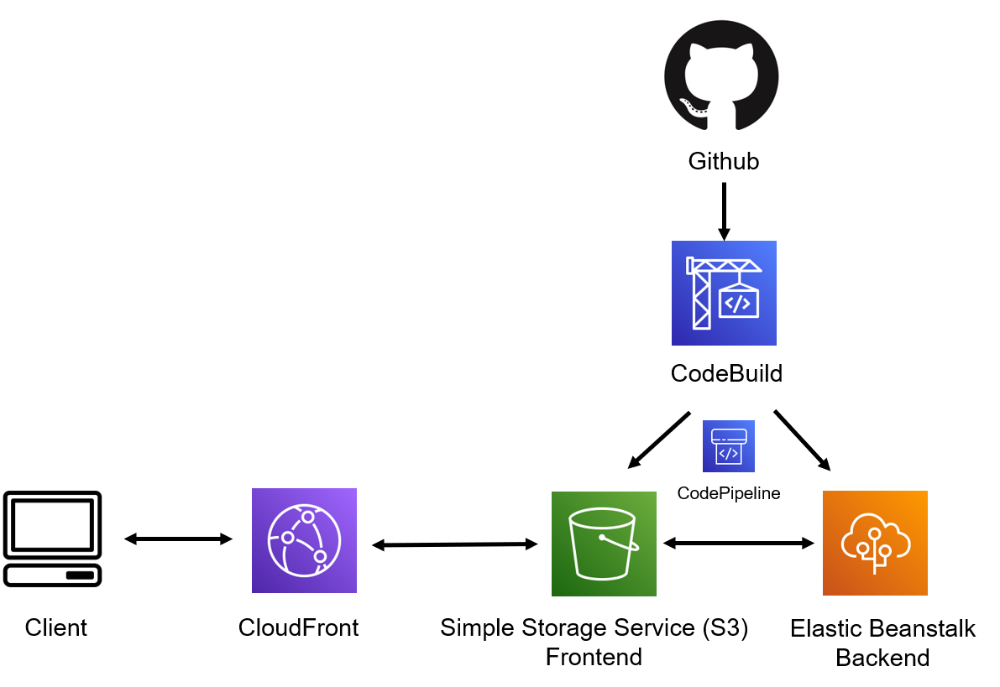

# simple-blastx
A web application that can determine whether a particular DNA strand encodes a portion of a protein in a well-known set.

## Local deployment
```docker-compose up --build```

Note that you might need to change the env variable `REACT_APP_BACKEND_URL` value from `http://localhost:8080/api` to `http://192.168.99.101:8080/api` in `docker-compose.yaml`, if you are using `Docker Quickstart Terminal on Windows`. Test the app at http://localhost:3000 or http://192.168.99.101:3000 (IP obtained from `docker-machine ip`)

## Cloud deployment
I set up a CICD pipeline using CodePipeline with Github as the source, CodeBuild as the builder, and Elastic Beanstalk (backend) and S3 (static frontend) as the deployment platforms. There is also a CloudFront in front of S3 as a content distribution service.

CloudFront URL: [here](https://d2thuo4s7eempw.cloudfront.net/)

The  following is the CICD pipeline
